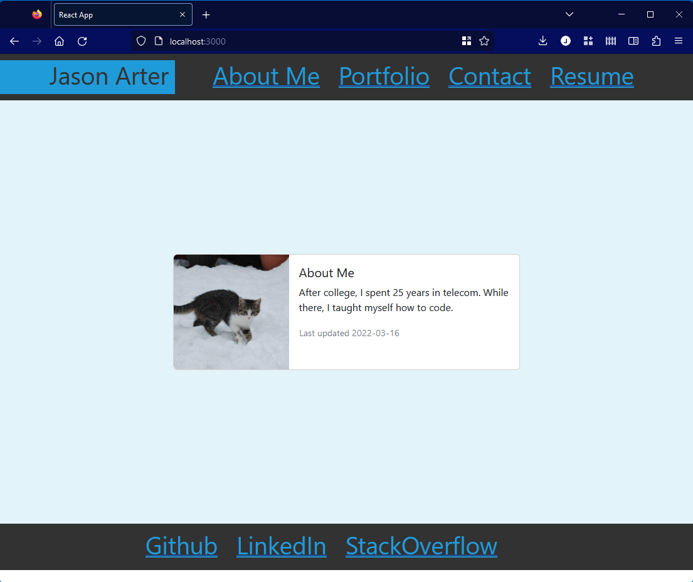

# ReactPortfolio

## Description

This project used React.js to create a personal portfolio.


## Table of Contents (Optional)

- [Installation](#installation)
- [Usage](#usage)
- [License](#license)
- [Contributions](#contributions)

## Installation

To install:
```
git pull git@github.com:error201/ReactPortfolio.git
```
In a terminal window, navigate to the cloned folder and run the following to install the needed NPM packages:
```
npm i
```
After the packages are installed, run the following command to start the app:
```
nodemon start
```
## Usage

Click the links and watch the magic happen.




## License

This project is covered under the MIT license. Please see [LICENSE](./LICENSE) for details.

---

## Contributions
Image courtesy of placekitten.


## Badges


## How to Contribute

Feel free to fork this repository!
